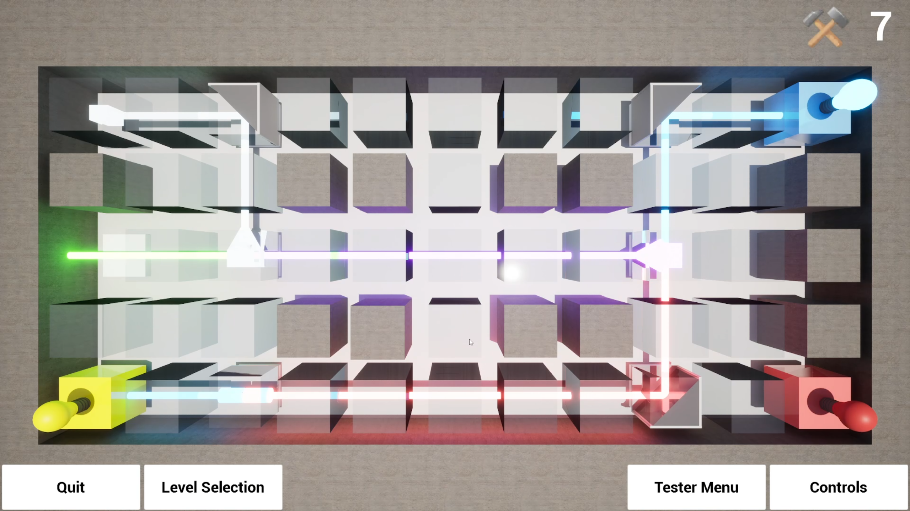
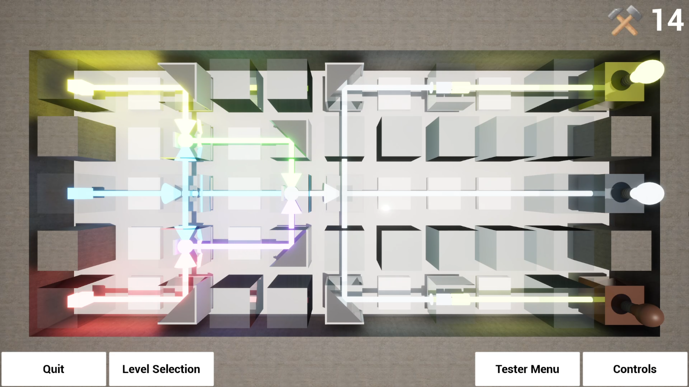
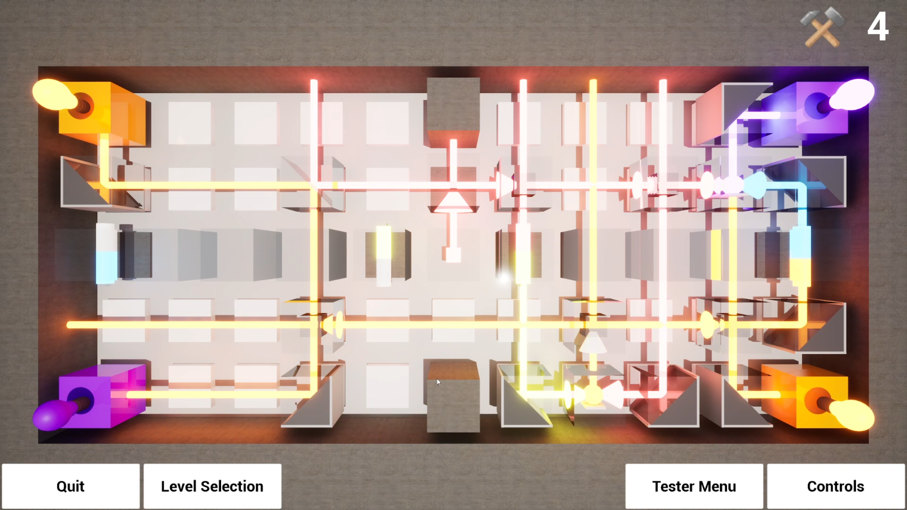
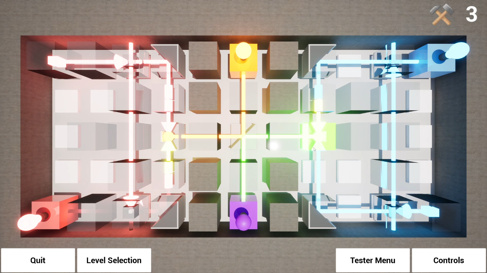
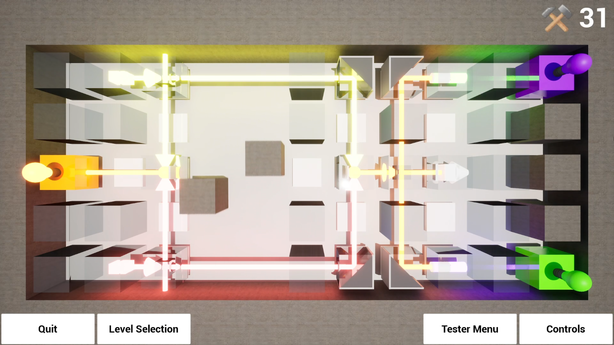
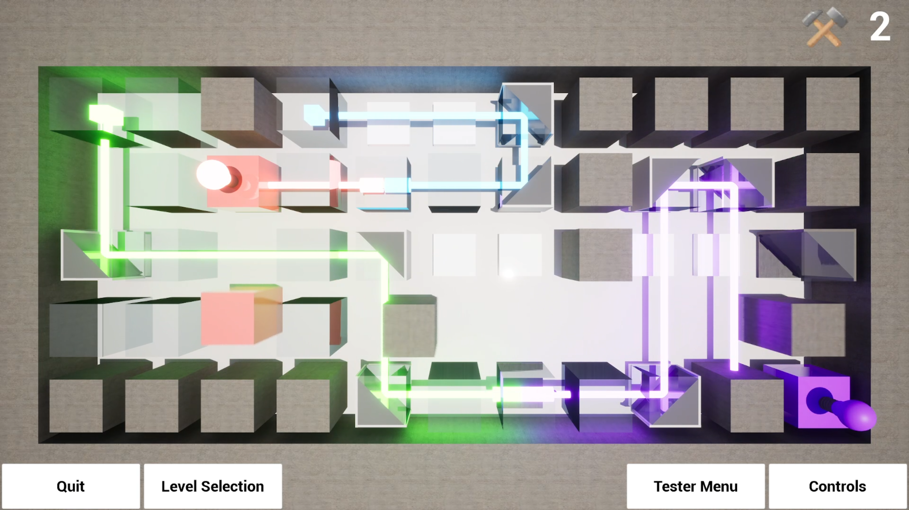
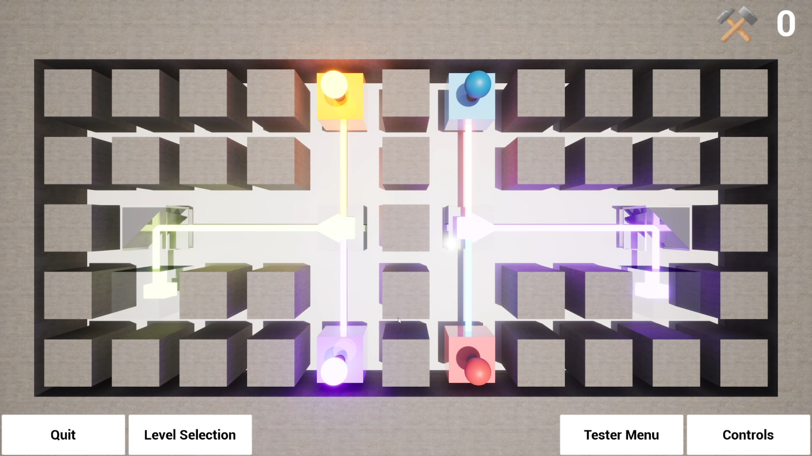
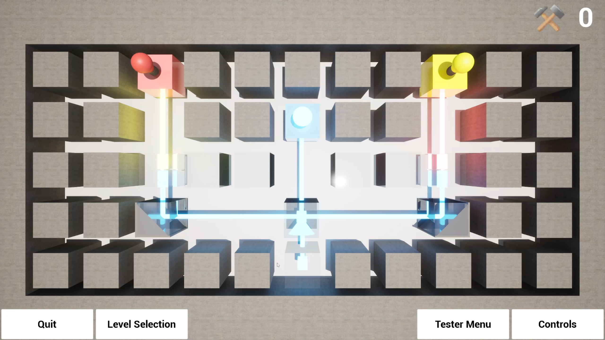

# Light the Bulb

[Download demo build](https://mega.nz/folder/iMFFXRKY#ytnZmNzasQILipRPJr0fzg)

---

## Game Description
**Light the Bulb** is a 3D puzzle game prototype developed in **Unreal Engine** using *Blueprints*.

As my first Unreal Engine project, it explores laser-based logic puzzles. The player must *light all bulbs* in a level by routing and manipulating *colored lasers* to match each bulb’s color.

To achieve this, players place and rotate components such as *mirrors*, *color changers*, *color mixers*, and *color separators*. Each component has a *cost*, and every level has a *build limit*, so the solution requires both *correct color logic* and *efficient construction*.

Each level emphasizes:
- Color matching and beam routing
- Resource-constrained planning
- Iteration and experimentation

---

## My Contributions
I worked on almost every aspect of the game except background music:

- **Core Mechanics:** laser emission/propagation, color mixing/splitting rules, collision handling and object placement/rotation/destruction.
- **Puzzle Systems:** build limit & per-part costs, win conditions, reset/undo flows, and level validation.
- **VFX & Visuals:** emissive laser beams, bulb glow states, and simple materials for clear readability.
- **Level Design:** prototype levels that progressively teach color logic and constraint management.

---

### References / Sources
| Type  | Description / Source | Link |
|------|------------------------|------|
| Music | Background music track (royalty-free) | [https://www.youtube.com/@NoCopyrightSounds] |

> All external assets are used for **non-commercial purposes only**; this is a portfolio prototype.

---

## Video Walkthrough

Tutorial Levels - [https://youtu.be/EYwGWRo3BJw]

Normal Levels - [https://youtu.be/-1fZn31rMbs]

---

## Screenshots

---

